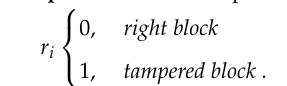

## Procedure 1: Merkle Tree Generation

  **Input**: Original Image `Iorg`
  **Output**: Merkle tree `M`

### Steps
- [x] Take `k` MSBs from each pixel in the original image `Iorg` to create a new image `I`.
- [x] Slice image `I` into non-overlapping blocks `Bi`, where the block size is `N x N` pixels.
- [x] Encrypt each block `Bi` to get `Bi_e` using encryption `EK(Bi)`.
- [x] Upload `Bi_e` to IPFS and take the unique hash (fingerprint) as `TXi`, generated by IPFS.
- [x] Generate Merkle tree `M` by taking `TXi` as the leaf node of the Merkle tree.
- [x] Store `TXi` and the Merkle Root of `M` in the blockchain.

# Image Verification Process

## Steps to Verify Image Authenticity

- [ ] **Input: Unverified Image Iunv**
- [ ] **Output: Set of the tampered result Ri = (r1, r2, ..., rn)**
  

### Steps:

1. [ ] **Generate Merkle tree Munv of Iunv** by using the Merkle tree generation method (refer to Section 3.1).
2. [ ] **Retrieve Morg** corresponding to the original image from the blockchain.
3. [ ] **Check the size of Morg and Munv Merkle trees:**
   - [ ] If both have the same size, then go to Step 4.
   - [ ] Else, set each ri to 1 and stop the procedure.
4. [ ] **Compare Morg and Munv recursively from root to the tree left:**
   - [ ] Check left side child hashes followed by right side child hashes.
   - [ ] If the node matches, set the value of ri to 0.
   - [ ] If the node does not match:
     - [ ] If it is the bottom node of the Merkle tree, set the value of ri corresponding to the node to 1.
     - [ ] Else, compare the child nodes.
5. [ ] **Repeat Step 4** until all nodes have been checked.
