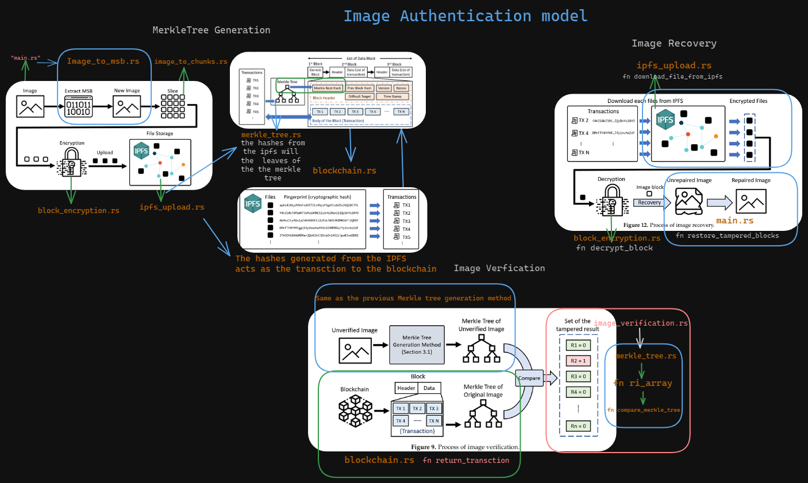

# 🦀Image Authentication Scheme Using Blockchain and Merkle Tree🦀

<div align="center">
  <a href="https://github.com/mfts/papermark/stargazers"></a>
  <a href="https://github.com/whoisgautxm/Image-Authentication-Model-in-Rust/blob/main/LICENSE"></a>
    <h3>🌟🌟Contributors🌟🌟</h3>
  <a href="https://github.com/whoisgautxm/Image-Authentication-Model-in-Rust/graphs/contributors">
  
</a>
<h4>🔔 This project needs modification and not production ready.</h4>
</div>


## Overview

This project implements an image authentication scheme using Merkle tree mechanisms in Rust. The main goal is to achieve image integrity verification by leveraging blockchain technology and the Inter-Planetary File System (IPFS). The proposed method not only verifies the integrity of the image but also restores tampered areas if the image has been altered.

## Features

- **Image Integrity Verification**: Uses Merkle tree mechanisms to verify the integrity of images.
- **Tampered Area Restoration**: Restores the tampered areas of images.
- **Decentralized Storage**: Utilizes IPFS for decentralized storage of images.
- **Blockchain Technology**: Implements blockchain to store the Merkle root for secure verification.

## Files

- `image_into_chunks.rs`: Handles the slicing of images into chunks.
- `image_verification.rs`: Implements the image verification process using the Merkle tree mechanism.
- `image_to_msb.rs`: Converts images to their Most Significant Bits (MSB) for further processing.
- `blockencryption.rs`: Contains functions for encrypting image blocks.
- `blockchain.rs`: Manages blockchain-related operations.
- `merkle_tree.rs`: Implements Merkle tree operations.
- `ipfs_upload.rs`: Manages the upload of image blocks to IPFS.
- `main.rs`: The main entry point of the application.

## Installation

1. **Clone the repository**:
    ```sh
    git clone https://github.com/whoisgautxm/Image-Authentication-Model-in-Rust.git
    cd Image-Authentication-Model-in-Rust
    ```

2. **Install Rust**:
    Follow the instructions on [rust-lang.org](https://www.rust-lang.org/) to install Rust.

3. **Build the project**:
    ```sh
    cargo build
    ```

4. **Run the project**:
    ```sh
    cargo run
    ```

## Usage

1. **Image Slicing and Encryption**:
    - The image is sliced into non-overlapping blocks.
    - Each block is encrypted and uploaded to the IPFS system.

2. **Merkle Tree Generation**:
    - The unique hash (fingerprint) of each image block is used as a transaction in the blockchain.
    - A Merkle tree is generated with these transactions, and the Merkle root is stored in the blockchain.

3. **Image Verification**:
    - The Merkle tree for the unverified image is generated.
    - This tree is compared with the original image's Merkle tree from the blockchain to verify integrity and identify tampered areas.

## Detailed Workflow



1. **Image Processing**:
    - Extract the k Most Significant Bits (MSBs) of each pixel.
    - Slice the image into blocks of size N x N pixels.

2. **Encryption and IPFS Upload**:
    - Encrypt each block.
    - Upload encrypted blocks to IPFS and get their unique hashes.

3. **Blockchain Integration**:
    - Use the hashes as transactions to build a Merkle tree.
    - Store the Merkle root in the blockchain.

4. **Verification Process**:
    - Generate Merkle tree for the received image.
    - Retrieve the original Merkle tree from the blockchain.
    - Compare both trees to identify tampered blocks.

## Contributing

Contributions are welcome! Please fork this repository and submit pull requests.

## License

This project is licensed under the MIT License - see the [LICENSE](LICENSE) file for details.

## References

- [An Image Authentication Scheme Using Merkle Tree Mechanisms](https://www.mdpi.com/1999-5903/11/7/149)
